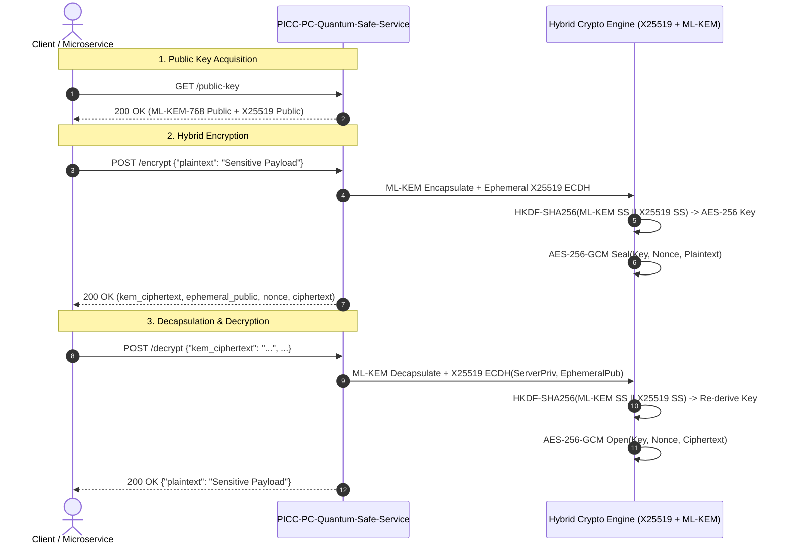

# User Manual and Deployment Guide: `PICC-PC-Quantum-Safe-Service`

This document provides a comprehensive operational and deployment guide for the **`PICC-PC-Quantum-Safe-Service`** microservice within the **Nubo Native Platform (NNP)**. It covers cryptographic architecture, runtime configuration, REST API operations, local containerization, Kubernetes production deployment, and security hardening.

---

## Table of Contents

1. [Service Architecture & Role](#1-service-architecture--role)
2. [Prerequisites & System Requirements](#2-prerequisites--system-requirements)
3. [Configuration Reference](#3-configuration-reference)
4. [Cryptographic Architecture & API Reference](#4-cryptographic-architecture--api-reference)
   - [Hybrid Cryptographic Workflow](#hybrid-cryptographic-workflow)
   - [GET /health (Liveness Probe)](#get-health-liveness-probe)
   - [GET /public-key (Public Key Retrieval)](#get-public-key-public-key-retrieval)
   - [POST /encrypt (Hybrid Encryption)](#post-encrypt-hybrid-encryption)
   - [POST /decrypt (Decapsulation & Decryption)](#post-decrypt-decapsulation--decryption)
   - [GET /docs & GET /openapi.yaml (Swagger UI)](#get-docs--get-openapiyaml-swagger-ui)
5. [Local Build & Containerization](#5-local-build--containerization)
   - [Local Execution with Go](#local-execution-with-go)
   - [Docker Container Build & Run](#docker-container-build--run)
   - [Docker Compose Multi-Container Setup](#docker-compose-multi-container-setup)
6. [Production Deployment on Kubernetes](#6-production-deployment-on-kubernetes)
   - [CNCF Restricted Pod Security Standards](#cncf-restricted-pod-security-standards)
   - [Secret Generation & Key Provisioning](#secret-generation--key-provisioning)
   - [Production Deployment Spec](#production-deployment-spec)
   - [Verification & Cluster Testing](#verification--cluster-testing)
7. [Security Hardening & Zero-Trust Key Lifecycle](#7-security-hardening--zero-trust-key-lifecycle)
8. [Troubleshooting & Frequently Asked Questions](#8-troubleshooting--frequently-asked-questions)

---

## 1. Service Architecture & Role

`PICC-PC-Quantum-Safe-Service` provides post-quantum cryptographic confidentiality for platform services. By combining a classical **X25519 (ECDH)** key exchange with post-quantum **ML-KEM-768 (FIPS 203)** key encapsulation, the service implements defense in depth: even if quantum computers compromise discrete logarithm/elliptic-curve cryptography in the future, or an unforeseen flaw is discovered in lattice algorithms, the derived **AES-256-GCM** encryption key remains mathematically protected.



---

## 2. Prerequisites & System Requirements

### Hardware Requirements
- **CPU**: 1 vCPU minimum (2 vCPU recommended for high-throughput crypto workloads).
- **Memory**: 128 MB RAM minimum (256 MB recommended).
- **Architecture**: AMD64 (x86_64) or ARM64.

### Software Prerequisites
- **Go**: 1.24+ (for compiling from source).
- **Docker**: 24+ and Docker Compose v2.
- **Kubernetes**: 1.28+ with Pod Security Admission active.

---

## 3. Configuration Reference

The service reads configuration exclusively from environment variables with safe defaults:

| Environment Variable | Type | Default | Description |
|---|---|---|---|
| `PORT` | Integer / String | `8080` | HTTP port on which the microservice listens. |
| `GIN_MODE` | String | `release` | Gin framework mode (`release` for production, `debug` for local testing). |
| `MLKEM_KEY_PATH` | String | `keys/mlkem_private.key` | Path on disk to load/save the persistent hybrid private key. |
| `MLKEM_KEY_JSON` | String | `""` | Optional direct JSON string of the private keypair (takes precedence over file). |

---

## 4. Cryptographic Architecture & API Reference

### Hybrid Cryptographic Workflow
- **Algorithm Identifier**: `Hybrid: X25519 + ML-KEM-768 + HKDF-SHA256 + AES-256-GCM`
- **KEM Ciphertext Size**: 1088 bytes (ML-KEM-768 encapsulated ciphertext).
- **Ephemeral Public Key Size**: 32 bytes (X25519 sender public key).
- **Nonce Size**: 12 bytes (96 bits) randomly sampled per encryption.
- **AEAD Tag**: 16 bytes (128 bits) appended to ciphertext by AES-GCM.

---

### GET /health (Liveness Probe)
Checks microservice liveness.

**Request**:
```bash
curl -s http://localhost:8080/health
```

**Response (`200 OK`)**:
```json
{
  "status": "ok"
}
```

---

### GET /public-key (Public Key Retrieval)
Fetches the server's long-term hybrid public keys.

**Request**:
```bash
curl -s http://localhost:8080/public-key
```

**Response (`200 OK`)**:
```json
{
  "algorithm": "Hybrid: X25519 + ML-KEM-768",
  "mlkem_public_key": "<base64-encoded-ml-kem-public-key>",
  "x25519_public_key": "<base64-encoded-32-byte-x25519-public-key>"
}
```

---

### POST /encrypt (Hybrid Encryption)
Encrypts a plaintext payload using the server's public keys.

**Request**:
```bash
curl -s -X POST http://localhost:8080/encrypt \
  -H "Content-Type: application/json" \
  -d '{"plaintext": "Confidential financial record #89421"}'
```

**Response (`200 OK`)**:
```json
{
  "algorithm": "Hybrid: X25519 + ML-KEM-768 + HKDF-SHA256 + AES-256-GCM",
  "kem_ciphertext": "m1m4...==",
  "x25519_ephemeral_public": "k9L1...==",
  "nonce": "p4d0...==",
  "ciphertext": "a8z9...=="
}
```

---

### POST /decrypt (Decapsulation & Decryption)
Decapsulates and decrypts a ciphertext payload created by `POST /encrypt`.

**Request**:
```bash
curl -s -X POST http://localhost:8080/decrypt \
  -H "Content-Type: application/json" \
  -d '{
    "kem_ciphertext": "m1m4...==",
    "x25519_ephemeral_public": "k9L1...==",
    "nonce": "p4d0...==",
    "ciphertext": "a8z9...=="
  }'
```

**Response (`200 OK`)**:
```json
{
  "plaintext": "Confidential financial record #89421"
}
```

---

### GET /docs & GET /openapi.yaml (Swagger UI)
Interactive API documentation is embedded directly inside the compiled binary:
- **Swagger UI**: Navigate to `http://localhost:8080/docs` in your browser.
- **Raw OpenAPI 3.0 Spec**: `GET http://localhost:8080/openapi.yaml`.

---

## 5. Local Build & Containerization

### Local Execution with Go
```bash
# Copy example environment configuration
cp .env.example .env

# Build binary
make build

# Run binary
make run
```

### Docker Container Build & Run
The included `Dockerfile` uses a multi-stage build creating an unprivileged Alpine Linux runtime:
```bash
# Build Docker image
docker build -t picc-pc-quantum-safe-service:latest .

# Run container with volume mounted for persistent keys
docker run -d \
  --name quantum-safe-service \
  -p 8080:8080 \
  -v "$(pwd)/keys:/app/keys" \
  picc-pc-quantum-safe-service:latest
```

### Docker Compose Multi-Container Setup
```bash
docker compose up -d
docker compose ps
docker compose logs -f
```

---

## 6. Production Deployment on Kubernetes

### CNCF Restricted Pod Security Standards
Deployments must enforce the CNCF **Restricted** Pod Security Profile:
- `runAsNonRoot: true` (UID/GID 10001)
- `readOnlyRootFilesystem: true`
- `allowPrivilegeEscalation: false`
- `capabilities.drop: ["ALL"]`
- `seccompProfile.type: RuntimeDefault`

### Secret Generation & Key Provisioning
For multi-replica deployments where pods must decrypt messages across restarts without a shared PVC, generate a Kubernetes Secret:

```bash
# Option A: Create secret from an existing key file
kubectl create secret generic nnp-quantum-safe-service-key-secret \
  -n nnp-core-components \
  --from-file=mlkem_private.key=keys/mlkem_private.key

# Option B: Create secret from direct JSON variable
kubectl create secret generic nnp-quantum-safe-service-key-secret \
  -n nnp-core-components \
  --from-literal=MLKEM_KEY_JSON='{"x25519_private":"...","mlkem_private":"..."}'
```

### Production Deployment Spec
Deploy the microservice using standard container orchestrators or apply an inline deployment specification pointing to the official image `ghcr.io/nubo-native-platform/picc-pc-quantum-safe-service:latest`:
```bash
kubectl create deployment nnp-quantum-safe-service \
  --image=ghcr.io/nubo-native-platform/picc-pc-quantum-safe-service:latest \
  --port=8080 -n nnp-core-components
```

### Verification & Cluster Testing
```bash
# Check pod status
kubectl get pods -n nnp-core-components -l app.kubernetes.io/name=nnp-quantum-safe-service

# Forward port for local testing
kubectl port-forward svc/nnp-quantum-safe-service 8080:8080 -n nnp-core-components

# Verify health
curl http://localhost:8080/health
```

---

## 7. Security Hardening & Zero-Trust Key Lifecycle

1. **Key Isolation**: Private keys are held in memory only for the duration of the process. Public keys can be freely distributed via `GET /public-key`.
2. **Ephemeral Nonces**: The 12-byte GCM nonce is generated afresh for every single message via cryptographically secure random bytes (`crypto/rand`).
3. **No Key Reuse for Encryption**: Ephemeral X25519 senders are generated per-request, preventing long-term traffic analysis.
4. **Supply Chain Protection**: Dependency versions are locked with cryptographic checksums (`go.sum`), verified via `go mod verify`, and scanned for CVEs via `govulncheck`.

---

## 8. Troubleshooting & Frequently Asked Questions

### Q: Why do I get a 400 Bad Request on `/decrypt`?
- **Cause**: The ciphertext was modified, or an incorrect `nonce` / `kem_ciphertext` was provided.
- **Explanation**: AES-256-GCM uses an authenticated tag. Any single bit flipped in transit causes authentication failure, returning a 400 error without leaking oracle clues.

### Q: How do multiple Kubernetes pods share the same private key?
- Provide the key via the `MLKEM_KEY_JSON` secret environment variable or mount a shared persistent volume to `/app/keys`. If neither is provided, each pod generates its own ephemeral key on startup.
